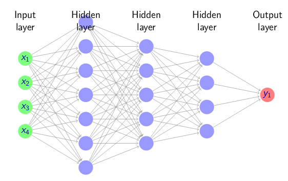
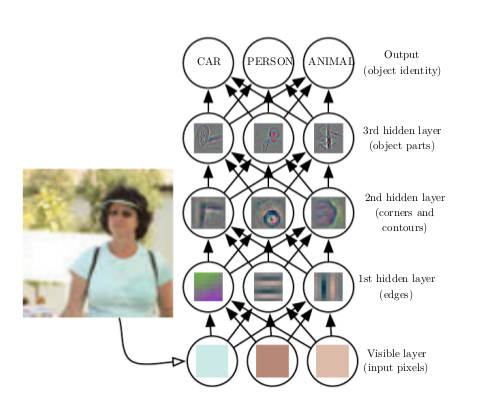
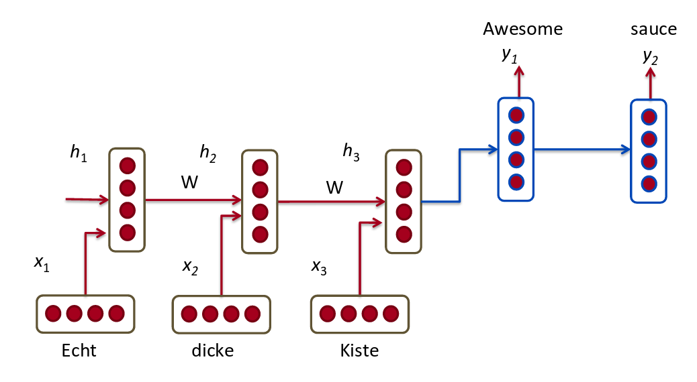

```{r setup, echo=FALSE, message=FALSE, warning=FALSE}
library(knitr)
library(ggplot2)
library(gridExtra)
library(dplyr)
library(datasauRus)
library(ggthemes)
library(ggExtra)
library(ggfortify)
library(forecast)
library(readr)
library(GGally)
library(splines)
library(Rtsne)
data("algae", package="DMwR2")
data("AirPassengers")
data("Default", package = "ISLR")


opts_chunk$set(cache=TRUE)
```


## Daten

Daten sind gut. Sie liefern uns Informationen, wieviele Einheiten wir verkauft haben; wie unser Umsatz war; wie es mit der Zufriedenheit unserer Kunden aussieht. Welche Werbebanner am meisten geklickt wurden. Welche unserer Strategien am besten funktioniert hat. Woraus wir unsererseits folgern können, wie wir jetzt am besten weiter vorgehen. Daten, konvertiert in Erkenntnisgewinn - und finanziellen Gewinn.

Daten sind schlecht. Daten sind "zuviel", um mit dem menschlichen Auge erfasst werden zu können. Wir müssen sie irgendwie zusammenfassen, vereinfachen. Wieviel Vereinfachung ist ausreichend? Einen Schritt zurück: Was überhaupt ist eine sinnvolle Vereinfachung, ein angemessenes _summary_ unserer Daten? Wie aussagekräftig ist der Mittelwert, den ich in den meisten Reports angezeigt bekomme?

Daten sind Vergangenheit, _in the past_. Vergangene Aktienkurse; vergangene Verkaufszahlen; vergangene Adclicks. Interessiert mich der Schnee von gestern? Ja - weil ich auf den Schnee von morgen schliessen möchte! Wie kann ich das machen? Wie kann ich die in den Daten enthaltene Information optimal nutzen und die relevanten Variablen "herausfischen"? Hier ist das Business-Know-How wichtig - aber nicht alles. Methoden aus Data Science, Machine Learning und Statistik warten nur darauf, uns zu unterstützen.

Und schliesslich gibt es eine Klasse von Daten, die anders sind - scheinbar unstrukturiert; vielschichtig; extrem hochauflösend und überwältigend schon aufgrund ihrer Quantität. Für uns Menschen ist es selbstverständlich, dass wir Sprache verstehen, einen Hund von einer Katze unterscheiden können, dass fahrende Autos anders klingen, wenn es nass als wenn es trocken ist. Auf Pixelebene aber gibt es nichts, was einen Hund zum Hund oder eine Katze zur Katze macht. 
Diese Daten, diese Aufgabenstellungen sind das Reich von Deep Learning, das mit gar nicht so neuen Konzepten, aber immer ausgefeilteren Algorithmen und viel Rechenpower jeden Monat neue Rekorde zu brechen scheint. Aber das betrifft doch nur "die Grossen" - Google, Facebook, Microsoft, Apple ... oder? Oder ist Deep Learning auch etwas für mich und meine Daten?

## Pfade durch den Dschungel

Wenn Daten heute ein Dschungel sind, sind Algorithmen es noch mehr. In diesem Artikel wollen wir Pfade durch den Algorithmendschungel ziehen, die Ihnen helfen sollen, die für Ihre Anforderungen und Bedürfnisse relevanten Methoden zu finden.

Daten werden dabei für uns vor allem in zwei Inkarnationen auftreten: Zum einen als Herausforderung. Hier geht es darum, die übergrosse Datenmenge in den Griff zu bekommen, zu summarisieren, ohne wichtige Features zu übersehen oder zu verfälschen.

Zum anderen als Chance. Welche Methoden stellen Data Science, Machine Learning, Deep Learning uns zur Verfügung, um Muster in den Daten zu finden und valide Schlussfolgerungen zu ziehen? Dabei geht es nicht um ein Potpourri der Methoden, ein Who's who der Algorithmen mit dem Ziel, alles einmal erwähnt zu haben. Es geht um den Überblick: Wie unterscheiden sich die Herangehensweisen, was sind die Konsequenzen, wenn ich mich für Methode B statt Methode A entscheide? Welches Vorgehen passt zu welchen Daten, zu welchen Fragestellungen? Es geht darum, den Dschungel zu "mappen", um das geeignete Vorgehen für den konkreten Anwendungsfall finden zu können.

# Teil 1: Daten als Herausforderung

Bevor wir fragen, was Data Science und Artificial Intelligence uns geben können, sollten wir schauen, was wir mitnehmen auf die Reise durch den Dschungel. Das ist v.a. ein Verständnis für die Grundlagen - wie exploriere ich Daten, wie charakterisiere ich sie so präzis wie möglich?


## Was ist ein gutes Summary?

Dass Mittelwerte ein fragwürdiges Summary sein können, hat jeder schon einmal gehört. Aber warum eigentlich ist das so bzw. in welchen Fällen?
Schauen wir uns zunächst einen Fall an, wo es nicht schadet, einen Mittelwert anzugeben: Abb. 1a.

```{r, echo=FALSE, fig.cap="Abb. 1: Mittelwert vs. Median. 1a: In etwa normalverteilte Daten - Mittelwert und Median liegen dicht beieinander. 1b: Stark schiefe Daten; der Mittelwert ist weit nach rechts gezogen."}
g1 <- ggplot(algae, aes(x = mxPH)) + geom_density(na.rm = TRUE) + 
  geom_vline(aes(xintercept = mean(algae$mxPH, na.rm = TRUE), linetype = "Mittelwert"), color = 'red') + 
  geom_vline(aes(xintercept = median(algae$mxPH, na.rm = TRUE), linetype = "Median"), color = 'green') + 
  scale_linetype_manual(name = "Statistik", values = c(2, 2), 
                      guide = guide_legend(override.aes = list(color = c("green", "red")))) +
 xlab("") + ylab("Dichte") + theme(legend.position="bottom") + 
  ggtitle("Datensatz A")

g2 <- ggplot(algae, aes(x = a1)) + geom_density(na.rm = TRUE) + 
  geom_vline(aes(xintercept = mean(algae$a1, na.rm = TRUE), linetype = "Mittelwert"), color = 'red') + 
  geom_vline(aes(xintercept = median(algae$a1, na.rm = TRUE), linetype = "Median"), color = 'green') + 
  scale_linetype_manual(name = "Statistik", values = c(2, 2), 
  guide = guide_legend(override.aes = list(color = c("green", "red")))) +
  xlab("") + ylab("Dichte") + theme(legend.position="bottom") + ggtitle("Datensatz B")

grid.arrange(g1, g2, ncol = 2)
```

Der Mittelwert liegt tatsächlich mittig in der Verteilung, direkt neben dem Median, dem Wert, unterhalb und oberhalb dessen jeweils die Hälfte der Werte liegen. Tatsächlich ist die hier gemessene Variable mehr oder weniger normalverteilt. Eine Normalverteilung ist symmetrisch und durch Mittelwert und Streuung (Varianz) hinreichend charakterisiert.


### Der Median

Wie kann es aber ausschauen, wenn die Daten weniger "schön normalverteilt" sind? Ein Beispiel sehen wir in Abb. 1b. Während der Median das Gros der Daten, das nahe 0 liegt, gut beschreibt, ist der Mittelwert weit nach rechts verschoben. Warum? Beim Median kommt es allein auf die Ordnung der Werte an, die Abstände sind unerheblich. Beim Mittelwert gehen die Abstände direkt in die Berechnung ein. Krasses Beispiel: Der Median der Wertreihe (1,2,3,4,1000) ist 3, der Mittelwert aber 202!

Insofern ist der Median, wenn es um knappe Charakterisierung der Daten geht, schon einmal ein besserer Kandidat als der Mittelwert. Für wirklich wichtige Daten und wenn ich den Platz habe, ersetzt aber nichts die Darstellung der gesamten Verteilung. 

Wie aussagekräftig ist z.B. der Median, wenn ich Daten habe wie in Abb. 2? Hier liegen die meisten Daten eben gerade nicht in der Mitte, sondern an den Enden der Verteilung...

```{r, echo=FALSE, warning=FALSE, message=FALSE, fig.cap="Abb. 2: Ein bimodaler Datensatz."}
betas <- rbeta(100,.5,.5)
ggplot(data.frame(x=betas), aes(x = x)) + geom_histogram(bins = 20) +
  geom_vline(aes(xintercept = mean(x), linetype = "Mittelwert"), color = 'red') + 
  geom_vline(aes(xintercept = median(x), linetype = "Median"), color = 'green') + 
  scale_linetype_manual(name = "Statistik", values = c(2, 2), 
                      guide = guide_legend(override.aes = list(color = c("red", "green")))) +
  ylab("Anzahl") + ggtitle("Datensatz C")

  
```


### Boxplots

Eine beliebte klassische Methode, eine ganze Verteilung zu visualisieren, statt sie auf eine einzige Zahl zu reduzieren, ist - seit langem - das Boxplot (Abb. 3a.). Für den Fall in Abb. 3 funktioniert das auch ziemlich gut: Wir sehen zum einen den Median (dicke horizontale Linie) und die für den Namen verantwortliche Box. In der Box liegen alle Werte zwischen dem 25. und dem 75. Perzentil.
(Kurz zur Terminologie: Das n-te Perzentil ist der Wert, unterhalb dessen in der Verteilung n Prozent der Werte liegen. Der Median ist also gleichzeitig das 50. Perzentil. Häufig trifft man auch auf die Bezeichnung Quartil; das 1. Quartil ist dann gleich dem 25. Perzentil, das 3 . Quartil gleich dem 75. Perzentil.)

Die vertikalen Linien ("Barthaare") haben mit dem sog. _inter quartile range_ (IQR) zu tun. Der IQR ist der Abstand zwischen dem 1. und dem 3. Quartil. Das obere Barthaar reicht dann bis zu dem grössten Wert, der nicht mehr als 1.5 * IQR von der oberen Boxgrenze entfernt ist; das untere entsprechend bis zum kleinsten Wert, dessen Entfernung zur unteren Boxgrenze nicht mehr als 1.5 * IQR beträgt. Werte, die dann noch ausserhalb liegen, sind als Punkte eingezeichnet und werden oft als Outlier gesehen.

Was zeigt uns nun das Boxplot in Abb. 3a? Man sieht unmittelbar, dass das obere Rechteck viel höher ist als das untere: Das heisst, zwischen dem 25. Perzentil und dem Median liegen die Daten sehr eng zusammen; zwischem dem Median und dem 75. Perzentil liegen sie weiter gestreut. Dasselbe Bild zeigen uns die "Barthaare": die obere Linie reicht sehr weit nach oben, während die untere sehr schnell bei 0 trunkiert wird. Nicht zufällig sind, was hier dargestellt wird, dieselben Daten wie in Abb. 1b.
Wir können die Aussagekraft des Boxplots noch steigern, indem wir, wie in Abb. 3b geschehen, Mittelwert und Modus (den häufigsten Wert der Verteilung, in diesem Fall 0) hinzufügen.


```{r, echo=FALSE, fig.cap="Abb. 3: Charakterisierung einer ganzen Verteilung durch ein Boxplot. 3a: Die rechtsschiefe Verteilung aus Abb. 1b. 3b: Dasselbe Boxplot, mit Mittelwert und Modus der Verteilung."}
g1 <- ggplot(algae, aes(x = 1, y = a1)) + geom_boxplot() + ylab("")
mod <-algae %>% group_by(a1) %>% summarize(n = n()) %>% arrange(desc(n)) %>% select(a1) %>% head(1)
g2 <- ggplot(algae, aes(x = 1, y = a1))  + geom_boxplot() + 
  geom_hline(aes(yintercept = mean(algae$a1)), color = "green", linetype=2) + 
  geom_hline(aes(yintercept = mod), color = "blue", linetype=4)  + 
  ylab("")
grid.arrange(g1, g2, ncol= 2, top = "Datensatz B")
```

### _Violin plots_

Wie hilfreich ist ein Boxplot für die Daten aus Abb. 2? Abb. 4a zeigt es: Man sieht nicht ohne weiteres, dass hier eine bimodale Verteilung, mit der grössten Dichte jeweils an den Enden, vorliegt.

Um nachzuhelfen, haben wir das Boxplot entlang der y-Achse um Strichmuster ergänzt, die die Dichte präziser widerspiegeln. Warum dann aber nicht gleich die ganze Verteilung zeigen, wenn wir dafür genauso viel Platz brauchen wie für das Boxplot? Abb. 4b zeigt ein sog. _violin plot_, nichts anderes als eine rotierte und gespiegelte Dichtekurve. Hier sieht man sofort, was los ist!


```{r, echo=FALSE, fig.cap="Abb. 4: Boxplot vs. violin plot für den bimodalen Datensatz. 4a: Boxplot. 4b: violin plot."}
g1 <- ggplot(data_frame(y = betas), aes(x = 1, y = betas)) + geom_boxplot() + geom_rug() +
  ylab("")
g2 <- ggplot(data_frame(y = betas), aes(x = 1, y = betas)) + geom_violin() + geom_rug() + ylab("")

grid.arrange(g1, g2, ncol= 2, top = "Datensatz C")
```

### Quantilplots

Auf den ersten Blick weniger leicht zu lesen als _violin plots_, dafür aber sehr aussagekräftig sind Quantilplots. Hier werden die Originaldaten dem Wert nach geordnet und dann gegen ihre Position in der Ordnung, ausgedrückt als Proportion zwischen 0 und 1, geplottet.

```{r, echo=FALSE, fig.cap="Abb. 5: Quantilplots. 5a: Quantilplot für den rechtsschiefen Datensatz. 5b: Quantilplot für den bimodalen Datensatz."}
sorted <- sort(algae$a1)
df <- data_frame(x = (1:(length(sorted)) - 0.5)/length(sorted), y = sorted)
g1 <- ggplot(df, aes(x=x, y=y)) + geom_point() + scale_x_continuous(c(0.0,1.0)) +
  ggtitle("Datensatz B")
sorted <- sort(betas)
df <- data_frame(x = (1:(length(sorted)) - 0.5)/length(sorted), y = sorted)
g2 <- ggplot(df, aes(x=x, y=y)) + geom_point() + scale_x_continuous(c(0.0,1.0)) +
  ggtitle("Datensatz C")
grid.arrange(g1, g2, ncol= 2)
```

Von den Quantilplots können wir nicht nur problemlos die wichtigen Quantile (0.25, 0.5, 0.75) ablesen: Wir haben zudem durch die Steigung ein gutes Gefühl für die Dichte der Daten. Vergleichen wir die beiden Quantilplots in Abb. 5a und Abb. 5b: Links haben wir Datensatz B, bei dem die niedrigen Werte eng zusammenliegen. Die sehr flache Steigung links des Medians zeigt, dass die Hälfte der Daten zusammenkommt, ohne dass der Wert merklich steigt. Nach dem Median nimmt die Kurve zunehmend Fahrt auf: Jetzt werden mit hinzukommenden Daten immer grössere Wertabstände überwunden.

Ganz anders Datensatz C, das nahezu eine S-Kurve beschreibt. Die Steigung ist maximal in der Gegend um den Median herum. An beiden Enden liegen mehr Werte als in der Mitte, daher die flache Steigung an den Enden des S.

### Informationsdichte und Plot-Design

Womit wir uns hier beschäftigt haben, ist die Aussagekraft und Informationsdichte von Plots und Kennzahlen. Das Wort Informationsdichte kann man aber auch wörtlicher verstehen: Wie lassen sich Plots designen, die den vorhandenen Raum optimal ausnutzen, d.h. bei gegebener räumlicher Beschränkung maximale Information übermitteln?


Leider haben wir hier nicht den Raum, ausführlich auf gestalterische Aspekte der Visualisierung einzugehen. Wer sich hierfür interessiert, dem seien die Bücher von Edward Tufte empfohlen [1]. Ein guter Einstieg ist der Essay über den _Cognitive Style of Powerpoint_ [2]. Wer den zum ersten Mal liest, wird nicht nur seine ggf. präexistenten Bedenken gegen den _bullet point style_ bestätigt finden (von Gewährspersonen wie Richard Feynman!): Das Eindrucksvollste ist, wie absurd die geringe Informationsdichte von typischen Powerpoint-"Tabellen" oder - Diagrammen plötzlich erscheint, wenn man sie mit hoch informativen Grafiken wie _sparklines_ [3] oder _slope graphs_ [4] vergleicht.


## Warum ist die Streuung der Daten wichtig?

Zurück zu den Kennzahlen. Bisher haben wir nur über Summaries bestehender Daten gesprochen.
Vielleicht ist das auch genug: Vielleicht möchte ich tatsächlich nur zusammenfassen, wie, unter gegebenen, ganz konkreten Bedingungen, "die Zahlen sich entwickelt haben". Aber oft will ich mehr: in andere Kontexte extrapolieren, zukünftige Werte vorhersagen oder (worum es im zweiten Teil gehen wird!) Zusammenhänge zwischen Variablen finden.

Sobald wir verallgemeinern, vorhersagen oder extrapolieren, verlassen wir das Reich der Gewissheiten. Es ist essentiell, dass wir uns über den Unschärfefaktor im klaren sind und ihn quantifizieren können. Die meisten der Methoden, die wir in Teil 2 besprechen werden, kommen bereits mit Angaben über die Unschärfe. Was kann man machen, wenn die Methode kein solches Mass liefert? 

Eine universell einsetzbare Methode ist der _Bootstrap_. Das geht so: Ich möchte die Beziehung zwischen zwei Variablen, sagen wir x und y, "allgemeingültig" charakterisieren, habe aber nur ein fixes Set von Daten. Dieser Datensatz ist eine mögliche Stichprobe von Werten aus der Population aller Werte. Nun behandle ich einfach meinen Datensatz, meine Stichprobe, selber als Population: Ich ziehe wiederholt Stichproben aus der Population und berechne jeweils die Beziehung zwischen x und y. (Die Analogie ist _cum grano salis_ zu nehmen; beim Bootstrap handelt es sich um _sampling mit replacement_, d.h. ein und derselbe Wert darf mehrmals gezogen werden, während das "in der Realität" meist nicht der Fall sein dürfte.) Auf diese Weise habe ich nun z.B. 100 Schätzungen meines Kennwertes und kann für diese Schätzung die Standardabweichung berechnen, d.h. die Wurzel aus der durchschnittlichen quadrierten Abweichung der Schätzungen von ihrem Mittelwert.

Gut - zum Umgang mit Streuung und Unsicherheit ist also der wichtigste Punkt, dass wir sie angeben müssen.
Aber was exakt soll ich angeben? Vielleicht haben Sie schon einmal die Floskel "+/-2 Standardabweichungen" gehört. Woher kommt das und was bedeutet diese Information?
Grundlage des ganzen ist das _zentrale Grenzwerttheorem_. 

Das _zentrale Grenzwerttheorem_ besagt, dass Mittelwerte einer Zufallsvariable im Limit unendlicher Stichprobengrösse normalverteilt sind. Die Normalverteilung der Mittelwerte hat als Mittelwert den wahren Mittelwert und als Standardabweichung den sog. _Standardfehler des Mittelwerts_ (die Standardabweichung der gemessenen Variable, geteilt durch die Wurzel der Stichprobengrösse). 

Was bringt uns das? Für die Normalverteilung wissen wir, wieviel Prozent der Verteilung zwischen dem Mittelwert und einer, zwei oder drei Standardabweichungen liegen (Abb. 6):

```{r, echo=FALSE, fig.cap="Abb. 6: Bei der Normalverteilung liegen zwischen Mittelwert +/- 1 Standardabweichung 68% der Werte, zwischen Mittelwert +/- 2 Standardabweichungen 95% der Werte, und zwischen Mittelwert +/- 3 Standardabweichungen 99% der Werte."}
normal_prob_area_plot <- function(lb, ub, mean = 0, sd = 1, limits = c(mean - 4 * sd, mean + 4 * sd), fcolor = "blue", title = "") {
    x <- seq(limits[1], limits[2], length.out = 100)
    xmin <- max(lb, limits[1])
    xmax <- min(ub, limits[2])
    areax <- seq(xmin, xmax, length.out = 100)
    area <- data.frame(x = areax, ymin = 0, ymax = dnorm(areax, mean = mean, sd = sd))
    (ggplot()
     + geom_line(data.frame(x = x, y = dnorm(x, mean = mean, sd = sd)),
                 mapping = aes(x = x, y = y))
     + geom_ribbon(data = area, mapping = aes(x = x, ymin = ymin, ymax = ymax), fill = fcolor)
     + scale_x_continuous(limits = limits) + ggtitle(title))
}
g1 <- normal_prob_area_plot(-3,3, title = "99%")
g2 <- normal_prob_area_plot(-2,2, title = "95%")
g3 <- normal_prob_area_plot(-1,1, title = "68%")
grid.arrange(g3,g2,g1, ncol=3, nrow=1, top="")
```

Damit kann ich für meine Parameterschätzung ein sog. Konfidenzintervall angeben. Leicht vereinfachend ausgedrückt: Wenn ich sage, meine Schätzung für den Parameter ist p +/- 2 mal Standardfehler, dann bin ich mir 95% sicher, dass der Parameter in diesem Bereich liegt. (Das ist in der Tat eine Vereinfachung. Siehe Literatur [6].) 

Was ich jetzt noch bedenken muss: Ein Konfidenzintervall für einen Parameter ist nicht dasselbe wie ein sog. Vorhersageintervall (_prediction interval_). Das Vorhersageintervall bezieht sich auf eine konkrete Vorhersage für neue Daten, und ist (z.T. erheblich) breiter als das Konfidenzintervall. 


## Was charakterisiert eine Beziehung?

"Die Korrelation zwischen Investition in Onlinemarketing und Produktabsatz beträgt 0.8". Ein hervorragendes Ergebnis, oder? (Der Korrelationskoeffizient liegt zwischen 0 und 1; tatsächlich ist 0.8 eine sehr hohe Korrelation.) Nun ja, vielleicht. Auch hier gilt wieder: Ein Bild sagt mehr als 1000 Kennzahlen.

Nehmen wir an, ich habe einen bivariaten Datensatz mit Variablen x und y. Ich kenne den Mittelwert von x (~54.26), den Mittelwert von y (~47.83) und die jeweiligen Standardabweichungen (~16.76 resp. ~26.93). Vor allem kenne ich die Korrelation zwischen x und y (~-0.06). Ein Korrelationskoeffizient von r = -0.06 bedeutet, die Daten sind unkorreliert, es gibt also keinen interessanten Zusammenhang. Wirklich?
Schauen wir auf Abb. 7: Alle diese Datensätze erfüllen die o.g. Bedingungen [10]. Jede Menge Zusammenhänge - nur eben nicht der lineare, den der Korrelationskoeffizient voraussetzt!

```{r, echo=FALSE, fig.cap="Abb. 7: Datasaurus Dozen - 13 Datensätze mit jeweils gleichen Mittelwerten und Standardabweichungen für x und y sowie gleicher (Nicht-) Korrelation."}
ggplot(datasaurus_dozen, aes(x=x, y=y, colour=dataset))+
    geom_point()+
    theme_void()+
    theme(legend.position = "none")+
    facet_wrap(~dataset, ncol=3)
```

Berühmt ist auch Simpson's Paradox, bei dem sich die Einschätzung komplett ins Gegenteil verkehrt, je nachdem, ob man die Daten als Gesamtheit betrachtet oder getrennt nach Subgruppen. Siehe Abb. 8: Die bei Gesamtbetrachtung stark positive Beziehung der Variablen wird zu einer stark negativen, wenn man den Datensatz in Gruppen aufteilt.

```{r, echo=FALSE, fig.cap="Abb. 8: Simpson's Paradox."}
ggplot(simpsons_paradox, aes(x=x, y=y, colour=dataset))+
    geom_point()+
    theme_void()+
    theme(legend.position = "none")+
    facet_wrap(~dataset, ncol=3)
```

Wie visualisiere ich nun am besten den Zusammenhang zwischen zwei Variablen? Das klassische Scatterplot ist dazu hervorragend geeignet. Beim normalen Scatterplot ist es allerdings nicht unbedingt einfach, die univariaten Verteilungen zu "sehen". Hier hilft es, z.B. ein Histogramm oder eine Dichtekurve hinzuzufügen, parallel zu den Achsen (Abb. 9):

```{r, echo=FALSE, fig.cap="Ab. 9: Scatterplots, ergänzt um die Abbildung der univariaten Verteilungen durch Histogramme oder Dichtekurven entlang der Achsen."}
g1 <- ggplot(datasaurus_dozen_wide, aes(x = bullseye_x, y = bullseye_y)) + geom_point() +
  theme_tufte(ticks=F) + theme(axis.title=element_blank(), axis.text=element_blank())
g1 <- g1 %>% ggMarginal(type = "density")
g2 <- ggplot(datasaurus_dozen_wide, aes(x = bullseye_x, y = bullseye_y)) + geom_point() +
  theme_tufte(ticks=F) + theme(axis.title=element_blank(), axis.text=element_blank())
g2 <- g2 %>% ggMarginal(type = "histogram", fill="transparent", bins = 20)
grid.arrange(g2,g1, ncol=2)
```

Diese Form der Visualisierung funktioniert hervorragend für bivariate Daten. Was, wenn die Zahl der interessierenden Variablen weit höher ist als 2?

## Aber die Dimensionalität meiner Daten ist viel zu hoch!

Eine beliebte Möglichkeit ist, die Daten durch Hauptkomponentenanalyse (_Principal Components Analysis_, PCA) zu komprimieren. PCA überführt die Daten in ein neues Koordinatensystem, so dass die erste Achse/Komponente am meisten der Varianz erklärt, die zweite am zweitmeisten, die dritte am drittmeisten etc. Zu einer Dimensionsreduktion führt das dann, wenn wir nur die ersten, wichtigsten Achsen behalten und die anderen "wegschmeissen". Zur (zweidimensionalen) Visualisierung eignet sich PCA besonders dann, wenn die ersten beiden Achsen tatsächlich den grössten Teil der Varianz erklären.

Abb. 10a zeigt das Ergebnis für einen Datensatz von Pixelbereichen eines Satellitenbilds. Für jeden Bereich soll aus je 36 multispektralen Pixelwerten ermittelt werden, wie die zugrundeliegende Bodenbeschaffenheit ist. Wir sehen, dass PCA einige Klassen gut, andere aber deutlich schlechter identifiziert.

PCA ist eine lineare Methode. Nichtlineare Daten lassen sich mit einer relativ neuen, nichtlinearen, nichtdeterministischen Methode namens t-SNE (_t-Distributed Stochastic Neighbor Embedding_) besser visualisieren. Abb. 10b zeigt das Eregebnis von t-SNE. Jetzt sind alle 6 in den Daten vorhandenen Klassen sehr schön erkennbar.

```{r, echo=FALSE, message=FALSE, fig.cap="Abb. 10: Reduktion 36-dimensionaler Daten durch PCA resp. t-SNE. 10a: PCA. 10b: t-SNE."}
par(mfrow= c(1,2), mai=c(0,0,0,0.2))
# https://archive.ics.uci.edu/ml/datasets/Statlog+%28Landsat+Satellite%29
sat <- read_delim("sat.trn", delim = " ", col_names = FALSE)
sat_data <- sat %>% select(-X37)
pca_out <- princomp(sat_data)
tsne_out <- Rtsne(sat_data) 
plot(pca_out$scores[,1:2], col=sat$X37, xlab = "", ylab="", xaxt='n', yaxt='n')
plot(tsne_out$Y,col=sat$X37, xlab = "", ylab="", xaxt='n', yaxt='n')
par(mfrow= c(1,1))
```

Wir haben gesehen, wie man Daten verschiedener Dimensionalität beschreibt und visualisiert. Damit ist es Zeit für Teil 2, also die Frage: Was kann ich jetzt mit meinen Daten anfangen?


# Teil 2: Daten als Chance

Nachdem wir jetzt das nötige Rüstzeug haben, um uns im Dschungel zurechtzufinden, können wir uns endlich auf Schatzsuche begeben: Was für Erkenntnisse können wir aus den Daten ziehen, was für Methoden setzen wir ein?
Welche Methoden wir einsetzen, hängt von unserer Fragestellung und der Art der Daten ab.
Haben wir gewohnte, strukturierte Daten wie Verkaufszahlen, Ausgaben, Kundendaten, Business-Metriken o.ä., befinden wir uns im Bereich klassischer Methoden wie Regression, Decision Trees, Clusteranalyse etc. 

Ob man das eher _Data Science_ nennt, _Machine Learning_, _Data Mining_ oder _Advanced Analytics_, ist eine Frage der Vorlieben, der Richtung, aus der man kommt, oder des Umfelds, in dem man arbeitet - die Algorithmen dahinter sind dieselben. Auch die Übergänge zur Statistik sind fliessend. (Nicht umsonst wird im Literaturteil insbesondere ein Buch mit dem Titel "Introduction to Statistical Learning" empfohlen.) Im folgenden werde ich meist von Data Science sprechen.

Wenn also das (selbst unter der "Hype-Bezeichnung" Data Science!) das klassische Vorgehen ist, was ist dann die Alternative? Das ist das sogenannte _Deep Learning_, mit dem in Bereichen wie Bilderkennung, maschinelle Übersetzung oder Robotik zur Zeit jedes Jahr neue Rekorde gebrochen werden.

Auch wenn Deep Learning prinzipiell auf "klassische" Daten anwendbar ist, so liegen seine Stärken doch vor allem in Aufgabenstellungen wie den genannten. Deep Learning stellt die gewohnten Denkweisen auf den Kopf: Es geht nicht darum, das zu lösen, was für uns Menschen schwer und zeitraubend ist (komplizierte Kalkulationen zum Beispiel), sondern das, was uns leicht fällt: sprechen, verstehen, sehen, gehen. Traditionell sind es genau diese Dinge, die für Maschinen schwer sind - das ist es, was sich mit Deep Learning nun zunehmend ändert.

Aber bevor wir uns Deep Learning genauer anschauen, wollen wir sehen: Was geht mit, wozu hilft uns und wie macht man _Data Science_?

## Goodness of fit

Die Diskussion dessen, was wir mit Data Science machen können, wird unter dem Motto _Vorhersagen und Erklären_, oder auch: _Vorhersagen vs. Erklären_, stehen. Um Missverständnisse zu vermeiden, müssen wir eine Sache vorab klären: Wie messe ich, wie gut ein Modell ist?

Das Allerwichtigste: Immer an neuen Daten; niemals an denen, mit denen ich das Modell gefittet habe.
Egal, mit welcher Methode ich arbeite: Als erstes teile ich immer die Daten in zwei, ggf. drei, Sets, ein Training Set, ein Validation Set (optional) und ein Test Set.

Das Training Set benutze ich, um ein Modell zu fitten - sagen wir, ein Modell zur Bestimmung von Kundenzufriedenheit aus Faktoren wie Produktkategorie, Preiskategorie, Schnelligkeit der Lieferung etc. Während des gesamten Model Fittings lasse ich mein Test Set unberührt. Das Test Set verwende ich ausschliesslich, um die Performance des Modells abschliessend zu prüfen.

Gut - viele Modelle aber haben Parameter, die ich variieren kann (und sollte!), um die bestmöglichen Einstellungen zu finden. Wie kann ich wissen, welches Setting schlussendlich das beste Ergebnis liefern wird, wenn ich das Test Set nicht konsultieren darf?

Zu diesem Zweck habe ich möglicherweise das Validation Set. In diesem Fall würde ich das Validation Set benutzen, um die Performance unter verschiedenen Permutationen von Parameter Settings zu testen.
Häufiger ist der Einsatz von Kreuzvalidierung (_cross validation_). Bei der Kreuzvalidierung benutze ich das Training Set, um die besten Settings zu bestimmen. 

Das geht so: Ich unterteile das Training Set in _n_ Subsets (meist 5 oder 10). Nehmen wir 5 als Beispiel. Jetzt iteriere ich über die Subsets, und zwar so. Im ersten Schritt nehme ich die Subsets 1 bis 4, lege sie zusammen und trainiere auf dieser Datenbasis meine verschiedenen Modelle. (Der Einfachheit halber spreche ich hier von "Modellen", es kann sich aber durchaus um ein und denselben Algorithmus handeln, jeweils mit verschiedenen Parameter Settings.) Die Performance dieser Modelle teste ich nun am fürs Fitten nicht benutzten Subset, Subset 5. Dann wiederhole ich den Vorgang mit Subsets 2-5 fürs Fitten und Subset 1 zum Testen; Subsets 3,4,5,1 fürs Fitten und Subset 2 zum Testen; und so weiter, bis ich jedes Subset einmal zum Testen verwendet habe. Die Ergebnisse für die verschiedenen Modelle werden gemittelt, und ich habe eine valide Entscheidungsgrundlage für die Modellauswahl. Die Performance auf dem Test Set wird dann separat bestimmt.

Wie funktioniert die Trennung in Training Set und Test Set? Im Normalfall einfach als Zufallsauswahl.
Anders verhält es sich bei Zeitreihen, also Daten, die intrinsisch zeitlich geordnet sind. Hier würde man jeweils zusammenhängende Zeiträume für das Training Set und für das Test Set wählen.

Auf die Gefahr, die Wiederholung zu übertreiben: Die Performance eines Modells wird abschliessend immer nur am Test Set evaluiert. Wenn im folgenden, der Kürze halber, zu einer Methode nur ein Datensatz gezeigt wird, ist immer das Training Set gemeint, das Set, auf dem wir das Modell fitten. 

Jetzt aber schauen wir erst einmal, was es mit dem Gegensatz _Vorhersagen vs. Erklären_ auf sich hat.


## Vorhersagen vs. Erklären

Schauen wir auf Abb. 11. Links sehen wir ein klassisches Beispiel für sogenannte _Time series_  - (Zeitreihen-) Daten: monatliche Zahlen von Fluggästen. Zeitreihen können auch multivariat sein, d.h. mehrere Variablen umfassen, die man dann aufeinander beziehen kann - häufig aber haben wir eine einzelne Zeitreihe vorliegen und möchten Aussagen über den weiteren Verlauf machen.

Hier ist das Ziel ganz klar: Wir möchten eine möglichst korrekte Vorhersage! Damit haben wir ein ganz einfaches Entscheidungskriterium, welche Methode wir wählen sollen: Wir wählen die, die die beste Vorhersage liefert! (Für die Bestimmung der "besten Vorhersage" gilt, wie gerade besprochen: Model Fitting am Training Set und abschliessende Beurteilung am Test Set.).

Im abgebildeten Beispiel wurde ARIMA verwendet, die wahrscheinlich meistverwendete Methode zur isolierten Betrachtung einzelner Zeitreihen. 


```{r, echo=FALSE, fig.cap="Abb. 11: Eine univariate Zeitreihe samt Vorhersage mittels ARIMA."}
g1 <- autoplot(AirPassengers)
fit <- auto.arima(AirPassengers)
g2 <- autoplot(forecast(fit)) + theme(legend.position="bottom")
grid.arrange(g1,g2, ncol=2)
```


Nehmen wir nun an, wir haben eine Situation wie in Abb. 12 [16]. Hier geht es darum, den Verkaufspreis eines Anwesens aus Variablen wie Wohnraum, Grösse der Garage etc. vorherzusagen. Wie bei den Zeitreihen kann es auch hier einfach das Ziel sein, die bestmögliche Vorhersage zu machen (in diesem Fall, einen optimalen Verkaufspreis zu bestimmen, der weder potentielle Käufer verschreckt noch zu einem Verkauf unter Wert führt).

Das Ziel könnte aber auch sein, etwas über die Welt herauszufinden,  in diesem Fall: Was bestimmt eigentlich den Verkaufspreis? Das mag bei der Beschränkung auf Quadratmeterangaben und dergleichen wenig spannend wirken, wird aber schon anders, wenn wir sozioökonomische, geographische, politische Fakten hinzunehmen. Damit hier keine Missverständnisse aufkommen: Natürlich bedeutet der Fokus auf Erklären/Verstehen keinesfalls, dass wir hier notwendig ein wissenschaftliches Interesse verfolgen. Das kann sein, muss aber nicht. Es kann auch einfach darum gehen, durch Abstraktion die Entscheidungsfindung zu erleichtern. 

Je nachdem, was uns primär interessiert - die Genauigkeit der Vorhersage oder ein erklärendes Modell -, werden wir den Schwerpunkt auf unterschiedliche Methoden legen.


```{r, echo=FALSE, message=FALSE, warning=FALSE, fig.cap="Abb. 12: Verkaufsspreis von Anwesen und 6 Einflussvariablen."}
ames <- read_csv("ames_housing_train.csv")
ames_part <- ames %>% select(SalePrice,GrLivArea,FullBath,TotRmsAbvGrd,GarageYrBlt,GarageCars,GarageArea) %>% filter(GrLivArea < 4000) 
ames_part %>% ggpairs()
```


## Erklären

Wenn es mir primär ums Verstehen geht, sind lineare Modelle optimal - vorausgesetzt, die Daten lassen sich mit einem linearen Modell hinreichend gut abbilden. Warum? Wenn ich einen linearen Zusammenhang habe, kann ich die Schlussfolgerung ziehen: Erhöhung von x um eine Einheit führt zu Erhöhung von y um eine Einheit. Schauen wir uns das in einem Beispiel an (Abb. 13a):


```{r, echo=FALSE, message=FALSE, warning=FALSE, fig.cap="Abb. 13: Regression des Verkaufspreises auf Wohnfläche. 13a: Der Prädiktor ist die Wohnfläche. 13b: Der Prädiktor ist das Quadrat der Wohnfläche."}
fit1 <- lm(SalePrice ~ GrLivArea, data = ames_part)
preds1 <- predict(fit1, se = T)
df <- ames_part %>% mutate(pred1 = preds1$fit,
                            upper1 = preds1$fit + 2* preds1$se,
                            lower1 = preds1$fit - 2* preds1$se)
g1 <- ggplot(df, aes(x = GrLivArea, y = SalePrice)) + geom_point() +
  geom_line(aes(y = pred1)) + 
  geom_ribbon(aes(ymin=lower1, ymax=upper1), fill="green", alpha=0.2) +
  ggtitle(paste0("R²: ", round(summary(fit1)$r.squared,3), ", beta: ", round(fit1$coefficients[2],2)))

fit2 <- lm(SalePrice ~ I(GrLivArea^2), data = ames_part)
preds2 <- predict(fit2, se = T)
df <- ames_part %>% mutate(pred2 = preds2$fit,
                            upper2 = preds2$fit + 2* preds2$se,
                            lower2 = preds2$fit - 2* preds2$se)
g2 <- ggplot(df, aes(x = GrLivArea, y = SalePrice)) + geom_point() +
  geom_line(aes(y = pred2)) + 
  geom_ribbon(aes(ymin=lower2, ymax=upper2), fill="green", alpha=0.2) +
  ggtitle(paste0("R²: ", round(summary(fit2)$r.squared,3), ", beta: ", round(fit2$coefficients[2],2)))
grid.arrange(g1,g2, ncol=2)

```

Hier wurde eine einfache lineare Regression des Verkaufspreises auf die Wohnfläche gerechnet. Die Gerade zeigt das gefittete Modell: Mit jedem zusätzlichen Quadratfuss Wohnfläche steigt der Verkaufspreis in der Stichprobe um etwa 111 Dollar (beta in der Überschrift der Grafik). Das R² im Titel sagt uns, wie gut das Modell auf diese Daten (Trainingsdaten! s.o.) passt: Hier wurde 50% der Varianz in den Verkaufspreisen durch die Varianz in der Wohnfläche erklärt.

Wenn wir auf Abb. 13a schauen, können wir uns fragen, ob hier eine Gerade wirklich am besten die Daten beschreibt. Es sieht aus, als müsste eine Parabel besser passen, oder? Wir können, ohne das lineare Modell zu verlassen, eine Parabel fitten, indem wir die Prädiktor-Variable Wohnfläche quadrieren, wie in Abb. 13b geschehen. Optisch sieht das besser aus, der _goodness of fit_ - Wert R² ist aber tatsächlich niedriger.

Wie erklärend ist das Modell in Abb. 13b? Hier steigt der Verkaufspreis mit dem Quadrat der Wohnfläche. Das ist immer noch eine stark abstrahierende Aussage. Wenn wir Abb 13a und 13b vergleichen, können wir auf den Gedanken kommen, dass im unteren Range der Wohnflächenwerte der lineare Fit besser ist, im oberen der quadratische. Wir können zwei getrennte Regressionen rechnen, und kämen zu einem Ergebnis der Art: "Für niedrigere Wohnflächen ist der Zusammenhang mit dem Verkaufspreis eher linear, für grössere eher quadratisch". Vielleicht gehen wir aber noch weiter, und zerlegen den Wertebereich des Prädiktors in 5, 10, 20 Teile? 


## Vorhersagen

Wenn wir denken, der zu beschreibende Zusammenhang ist intrinsisch nichtlinear, macht es Sinn, die Grenzen des verwendeten Frameworks zu erweitern. Wir können viele lokale Regressionen rechnen (die ihrerseits noch linear sind), oder wir wählen direkt nichtlineare Methoden wie _Regression Splines_.
In Abb. 14 wurden drei Regression Splines gefittet, die sich durch ihren Grad an Flexibilität unterscheiden:

```{r, echo=FALSE, message=FALSE, warning=FALSE, fig.cap="Abb. 14: Regression splines mit unterschiedlicher Flexibilität."}
fit1 <- lm(SalePrice ~ bs(GrLivArea, knots = c(20000)), data = ames_part)
preds1 <- predict(fit1, se = T)
fit2 <- lm(SalePrice ~ bs(GrLivArea, df = 15), data = ames_part)
preds2 <- predict(fit2, se = T)
fit3 <- lm(SalePrice ~ bs(GrLivArea, df = 30), data = ames_part)
preds3 <- predict(fit3, se = T)
ames_part_pred <- ames_part %>% mutate(pred1 = preds1$fit,
                                       upper1 = preds1$fit + 2* preds1$se,
                                       lower1 = preds1$fit - 2* preds1$se,
                                       pred2 = preds2$fit,
                                       upper2 = preds2$fit + 2* preds2$se,
                                       lower2 = preds2$fit - 2* preds2$se,
                                       pred3 = preds3$fit,
                                       upper3 = preds3$fit + 2* preds3$se,
                                       lower3 = preds3$fit - 2* preds3$se
                                       )
g1 <- ggplot(ames_part_pred, aes(x = GrLivArea, y = SalePrice)) + geom_point() +
  geom_line(aes(y = pred1)) + 
  geom_ribbon(aes(ymin=lower1, ymax=upper1), fill="green", alpha=0.2) +
  ggtitle(paste0("R²: ", round(summary(fit1)$r.squared,3)))
g2 <- ggplot(ames_part_pred, aes(x = GrLivArea, y = SalePrice)) + geom_point() +
  geom_line(aes(y = pred2)) + 
  geom_ribbon(aes(ymin=lower2, ymax=upper2), fill="blue", alpha=0.2) +
  ggtitle(paste0("R²: ", round(summary(fit2)$r.squared,3)))
g3 <- ggplot(ames_part_pred, aes(x = GrLivArea, y = SalePrice)) + geom_point() +
  geom_line(aes(y = pred3)) + 
  geom_ribbon(aes(ymin=lower3, ymax=upper3), fill="red", alpha=0.2) +
  ggtitle(paste0("R²: ", round(summary(fit3)$r.squared,3)))
grid.arrange(g1,g2,g3, ncol=3)
```

Wir sehen, dass mit zunehmender Flexibilität der _Goodness of fit_ auf den _Trainingsdaten_ zunimmt.
Wie immer ist aber der Fit auf den Testdaten, worauf es ankommt. Nehmen wir einmal an, das Modell in der Mitte hätte sich in der Kreuzvalidierung als das beste erwiesen (weshalb wir davon ausgehen, dass es auch für die Testdaten die beste Performance zeigen wird).  Dann ist die Frage: Ist uns der verbesserte Fit gegenüber der linearen Regression wichtig genug, um auf den explanatorischen Wert der Regression zu verzichten?

In diesem Beispiel ist der Performancegewinn wahrscheinlich nicht deutlich genug, als dass wir uns diese Frage wirklich stellen würden - der Zusammenhang ist offenbar "linear genug" für lineare Regression. Was, wenn die wahren Daten definitiv nichtlinear sind?
Abb. 15 zeigt ein solches Beispiel. Nehmen wir wieder an, wir sähen jeweils pro Modell den besten Fit, ermittelt durch 10-fache Kreuzvalidierung - links für lineare Regression, rechts für die Familie der Regression Splines. Für welches Modell entscheide ich mich? Die Zahlen sind eine Sache; jetzt kommt es wirklich darauf an, wo meine Prioritäten liegen!

```{r, echo=FALSE, message=FALSE, warning=FALSE, fig.cap="Abb. 15: Lineare Regression vs. Regression Splines bei einem intrinsisch nichtlinearen Datensatz."}
set.seed(7777)
x <- seq(from = 1, to = 3, by = 0.1)
x <- sample(x, 200, replace = TRUE)
f <- function(x) x^3 - 3*x^2 + 2*x
y <- exp(x) + rnorm(100, sd = 3)
df <- data_frame(x,y)
fit0 <- lm(y ~ x, data = df)
preds0 <- predict(fit0, se = T)
df <- df %>% mutate(pred0 = preds0$fit,
                                       upper0 = preds0$fit + 2* preds0$se,
                                       lower0 = preds0$fit - 2* preds0$se)
g0 <- ggplot(df, aes(x = x, y = y)) + geom_point() +
  geom_line(aes(y = pred0)) + 
  geom_ribbon(aes(ymin=lower0, ymax=upper0), fill="green", alpha=0.2) +
  ggtitle(paste0("R²: ", round(summary(fit0)$r.squared,3)))
                 
fit1 <- lm(y ~ ns(x, df=6), data = df)
preds1 <- predict(fit1, se = T)
df <- df %>% mutate(pred1 = preds1$fit,
                                       upper1 = preds1$fit + 2* preds1$se,
                                       lower1 = preds1$fit - 2* preds1$se)
g1 <- ggplot(df, aes(x = x, y = y)) + geom_point() +
  geom_line(aes(y = pred1)) + 
  geom_ribbon(aes(ymin=lower1, ymax=upper1), fill="blue", alpha=0.2) +
  ggtitle(paste0("R²: ", round(summary(fit1)$r.squared,3)))
grid.arrange(g0,g1, ncol=2)
```


## Modellselektion

Im vorangehenden Abschnitt haben wir nur jeweils einen einzigen Prädiktor betrachtet.
In der Regel aber wird mein Datensatz mehrere potentielle Prädiktoren enthalten - in der Zeit von Big Data ggf. extrem viele! Wie wähle ich die wichtigsten aus?
Hier wird der Gegensatz zwischen Erklären und Vorhersagen vielleicht noch augenfälliger.
Das gleiche gilt für die Notwendigkeit, die finale Performance auf dem Test Set zu evaluieren.
Wenn ich nur genügend Prädiktoren habe, kann ich alle Daten perfekt fitten. Ganz nach dem berühmten John-von-Neumann-Zitat

>> With four parameters I can fit an elephant, and with five I can make him wiggle his trunk.

Kehren wir zurück zu unserem Immobilien-Beispiel. Wir können den Verkaufspreis mit einem Entscheidungsbaum vorhersagen. Dabei beschränken wir uns auf das Subset von Prädiktoren, das auch in Abb. 12 gezeigt wird. Wenn ich auf dem Training Set mittels Kreuzvalidierung die besten Parametersettings bestimme, erhalte ich den in Abb. 16a gezeigten Baum. Hier werden 4 von 6 möglichen Variablen zur Vorhersage verwendet. Der resultierende Split ist der, bei dem wir aufgrund der Kreuzvalidierung den niedigsten Fehler auf dem Test Set erwarten. 

```{r, echo=FALSE, message=FALSE, warning=FALSE, fig.cap="Abb. 16: Entscheidungsbäume. Abb. 16a: Der durch Kreuzvalidierung ermittelte Baum. Abb. 16b: Ein Baum mit 1129 Edknoten erklärt die Trainingsdaten nahezu perfekt, wird aber kläglich an den Testdaten scheitern."}
par(mfrow=c(1,2), cex=0.4)
library(tree)
fit <- tree(SalePrice ~ ., data = ames_part)
plot(fit)
text(fit)
#summary(fit)
library(tree)
fit <- tree(SalePrice ~ ., data = ames_part, control=tree.control(nobs = nrow(ames_part), mincut=1, minsize = 2, mindev = 0))
plot(fit)
#summary(fit)
par(mfrow=c(1,1), cex=1)
```

Was passiert, wenn wir den Algorithmus anweisen, keine Rücksicht auf Generalisierbarkeit zu nehmen, sondern die gegebenen Trainingsdaten optimal voherzusagen? Der resultierende Baum (Abb. 16b) lässt sich schon nicht einmal mehr beschriften, da er komplett unlesbar wäre. Er hat 1129 Endknoten - bei ingesamt 1456 Items im Datensatz! Das Training Set wird auf diese Weise hervorragend beschrieben - aber keine Chance, dass ein derart verästelter Baum auch das Test Set adäquat beschreibt. Was wir hier sehen, ist das grosse _don't do it_ der Data Scientists: _Overfitting_. _Don't overfit your training data._


Zurück zu unserem durch Kreuzvalidierung gewählten Baum. Wie erklärend ist das Modell? Entscheidungsbäume werden im allgemeinen als gut kommunizierbar und leidlich explanatorisch angesehen. Das gilt aber umso weniger, je mehr Splits der Baum hat und je mehr ein- und dieselbe Variable für verschiedene Splits wiederverwendet wird. 
Wir können den Vorhersagefehler gegen die Anzahl der Blätter plotten und uns für den Baum mit dem besten Trade-Off entscheiden. Im vorliegenden Beispiel z.B. für Baum mit 5 Endknoten (Abb. 17), der gleichermassen Einsicht vermittelt und die Daten gut beschreibt.

```{r, echo=FALSE, message=FALSE, warning=FALSE, fig.cap="Abb. 17: Der Baum mit 5 Endknoten ist ein guter Kompromiss zwischen Minimierung des Vorhersagefehlers und explanatorischem Wert. 17a: Vorhersagefehler, abhängig von der Anzahl der Endknoten. 17b: Der Baum mit 5 Knoten."}
par(mfrow= c(1,2), cex=0.4)
fit <- tree(SalePrice ~ ., data = ames_part)
cv_fit <- cv.tree(fit)
plot(cv_fit$size, cv_fit$dev, type='b', xlab = "Anzahl Endknoten", ylab="Deviance")
plot(prune.tree(fit, best=5))
text(prune.tree(fit, best=5))
par(mfrow= c(1,1), cex=1)
```


Was,wenn ich nicht erklären will, sondern tatsächlich einfach die bestmögliche Vorhersage brauche? Dann werde ich dezidiert eine der Methoden nehmen, die erfahrungsgemäss den Shootout der Algorithmen gewinnen (z.B. bei Data Science Competitions wie auf Kaggle). 

Am erfolgreichsten sind in der Regel Ensemble-Methoden, d.h. Methoden, die einen Algorithmus mehrfach anwenden und das Ergebnis mitteln. Im Bereich der Entscheidungsbäume sind das _Random Forests_ und _Boosting_. 

Gemeinsam ist beiden Ansätzen, dass sie die guten Ergebnisse gerade dadurch erzielen, dass man es "sich schwerer macht", um dadurch ein robusteres, von der Zufälligkeit der Trainingsdaten unabhängigeres Ergebnis zu erzielen. Im Falle von _Random Forests_ geschieht das dadurch, dass nicht jeder vorhandene Prädiktor für einen anstehenden Split in Erwägung gezogen wird - die Kandidaten werden jeweils zufällig ausgewählt, woraus sich der Name "Random Forest" herleitet. Im Falle von _Boosting_ ist es eine Kombination "schwacher Lerner", die in Synergie ein sehr gutes Ergebnis erzielen.

Es sich schwerer machen, um besser zu werden: Das ist ein Motto, unter das man viele erfolgreiche Methoden des Machine Learnings stellen könnte. Das gilt auch für das schon mehrmals angekündigte Deep Learning, das jetzt endlich tatsächlich seinen Auftritt hat.


## Heute _magic_, morgen _mainstream_: Deep Learning

Wenn wir von Data Science Competitions sprechen, dabei den Begriff etwas lockerer fassen und auf Machine Learning bis zu Künstlicher Intelligenz ausweiten, kommen wir an Deep Learning nicht vorbei. Wir haben schon gesagt, wo Deep Learning heute am meisten Anwendung findet und in der Regel die Methode der Wahl ist: Objekterkennung, Spracherkennung, maschinelle Übersetzung, Sprach- und Musikgenerierung, Generierung von Produktempfehlungen... bis hin zur Generierung von _fake evidence_ (Bilder, Audios, Videos, die es nie gegeben hat [17]).

Was aber ist Deep Learning, und wie funktioniert das? Deep Learning ist nichts als ein neuer Begriff für etwas, das es seit der Mitte des letzten Jahrhunderts gibt und dessen wichtigste Konzepte in den 1980er/1990er Jahren entwickelt wurden: künstliche neuronale Netze, vage an der Architektur biologischer Neuronen orientiert, mit einem input layer, einem output layer und dazwischen mindestens einem, oft mehreren _hidden layers_. Diese _hidden layers_ sind es, die die Netze beim Deep Learning _deep_ machen.

```{r, echo=FALSE, out.width = "400px", fig.cap="Abb. 18: Schematische Struktur eines deep neural network. Die Anzahl der hidden layers ist variabel. Aus: [15]."}

```

### Strukturen erkennen durch Feature-Generierung

Was Deep Learning so erfolgreich macht, ist aber nicht die blosse Aneinanderreihung von Layern. In den _hidden layers_ bilden sich Strukturen, die wichtige Eigenschaften des Input-Objekts abbilden und deren Synthese wiederum neue Strukturen generiert. Deswegen sind die Netze auch keine amorphe Masse von "computing units", sondern haben jeweils eine der Aufgabenstellung angemessene Architektur. 

Im Bereich Objekterkennung und -klassifizierung z.B. werden _CNNs_ eingesetzt, _Convolutional Neural Networks_. Abb. 19 zeigt ein Beispiel. Das Netz soll sagen, ob das Bild im Input z.B. eine Person, ein Tier, ein Auto etc. ist. Was es bekommt, sind aber lediglich Pixel! Wie kann das funktionieren? Die sukzessive Extraktion komplexerer Strukturen ist die Aufgabe der _hidden layers_. Zum Beispiel so: Im ersten Layer werden Kanten identifiziert, im zweiten Ecken und Konturen, im dritten Teile von Objekten (eine Nase, ein Arm...), und so weiter, bis am Ende die Klassifikation erfolgt: "Das ist eine Person". Dabei werden also sukzessive komplexere Features erkannt, ohne dass der Programmierer diese von aussen vorgegeben hätte.

```{r, echo=FALSE, out.width = "400px", fig.cap="Abb. 19: Beispielhafte Darstellung der Funktion von hidden layers bei einem Convolutional Neural Network. Aus: [12]."}

```

### Sequenzen: Sprache & co.

Was ist mit Daten, die eine inhärente sequentielle Struktur haben? Sprache, Zeitreihen, Musik...
Das ist die Domäne der  _RNNs_, der _Recurrent Neural Networks_. RNNs haben zusätzlich zu der "Tiefenstruktur" noch eine weitere verborgene Struktur, den _hidden state_. Der _hidden state_ transportiert die Information über vorherige Inputs. Im Bereich der RNNs ist der _model zoo_, die Vielfalt existenter Architekturen, besonders gross. Die am meisten eingesetzte Architektur _as of today_  ist wahrscheinlich das _LSTM_, _Long Short Term Memory Network_.

Eine sehr praxisrelevante Anwendung - wer hat noch nie Google Translate benutzt? - ist maschinelle Übersetzung. Hier sind nicht nur die Eingabedaten sequentiell, sondern auch die Ausgabedaten, was das Problem noch weiter kompliziert. Hier werden sog. _seq2seq_ Architekturen eingesetzt (Abb. 20), mit je einem RNN für den Input und den Output. In komplexeren Modellen als dem abgebildeten gibt es zudem einen Aufmerksamkeitsmechanismus, _attention_, der dem Netz sagt, welcher Teil des Inputs für welchen Teil des Outputs relevant ist.

```{r, echo=FALSE, out.width = "400px", fig.cap="Abb. 20: seq2seq-Architektur für maschinelle Übersetzung. Aus: [13]."}

```


### Deep Learning in der Praxis

Eine Vielfalt von Aufgabenstellungen, Architekturen, Hyperparametern und Frameworks (über die wir aus Platzgründen ein anderes Mal sprechen müssen) - ist das nicht viel zu komplex, um im Alltag anwendbar zu sein? Ganz zu schweigen von der Rechenpower, die es braucht, die optimalen Hyperparameter-Settings zu finden, und der Menge an Trainingsdaten, mit der das Netz gefüttert werden muss?

Erstaunlicherweise ist Deep Learning sehr viel "anwendbarer", als man meinen könnte. Passable Performance ist oft auch schon mit geringeren Datenmengen und überschaubarem Trainingsaufwand zu erreichen. Um das letzte an Performance "herauszukitzeln", verwendet man vortrainierte Modelle, die frei heruntergeladen werden können. Und auch konzeptuell ist vieles aus dem traditionellen Machine Learning aufs Deep Learning übertragbar: so zum Beispiel das oben erwähnte Prinzip des "es sich schwerer Machens", das im Deep Learning als _dropout_-Hyperparameter auftritt und das Ausmass bezeichnet, in dem Neuronen im Training zufällig "ausgeschaltet" werden. Auf diese Weise wird im Training _noise_ erzeugt, der zu einer besseren Generalisierung und damit auch zu besserer Performance auf neuen Daten führt.

So haben Statistik, Machine Learning und Deep Learning, so unterschiedlich sie auf den ersten Blick wirken, doch ganz grundlegende konzeptuelle Gemeinsamkeiten, die ihren synergetischen Einsatz ganz natürlich erscheinen lassen.

## Literatur

Literaturtipps zu Statistik, Visualisierung, Data Science, Deep Learning in ein paar Sätzen - das kann nur eine sehr subjektive, sehr eklektische Zusammenstellung von Pointern sein. 
Ins Positive gewendet: Was folgt, sind aus meiner Sicht _ein paar_ der Highlights des Feldes (der Felder, vielmehr): Bücher, die Spass machen zu lesen, Videos, die Spass machen zu schauen... etc.

### Statistik und Visualisierung

Natürlich gibt es eine Reihe hervorragender Einführungen in die Statistik, auf jedem gewünschten Niveau. Spannend sind vor allem neue Sichtweisen, die die letzten Jahre gebracht haben, u.a. als Folge der "Replikationskrise" in der Psychologie und der zunehmenden praktischen Anwendbarkeit Bayes'scher Statistik. Empfohlen seien hier z.B. die hervorragenden MOOCs "Statistical Inference" der Johns Hopkins Universität [5] und "Improving your statistical inferences" der TU Eindhoven [6].

Welche Erkenntnisse sich aus der visuellen Aufbereitung von Daten ziehen lassen, zeigen sehr schön die Bücher des berühmten Statistikers John Tukey und seiner Mitautoren über explorative Datenanalyse. Als Beispiel sei hier "Graphical methods for data analysis" empfohlen [7].

Im Übergangsbereich zwischen Datenexploration und Grafikdesign liegen die auch optisch sehr ansprechenden Bücher von Edward Tufte, etwa das jüngste mit dem programmatischen Namen "Beautiful evidence" [1]. Der augenöffnende Essay über den "Cognitive Style of Powerpoint" ist frei als PDF verfügbar [2].


### Data Science und Machine Learning

Auch zum Thema Data Science gibt es einige hervorragende MOOCs, u.a. auch wieder von der Johns Hopkins University. Zur Abwechslung sei hier aber ein (noch dazu relativ dünnes) Buch empfohlen: das hervorragend konzipierte und geschriebene "Introduction to Statistical Learning" von Hastie et al. Zusätzlich zu den wunderbar klaren Erläuterungen enthält das Buch praktischen R Code, mit dem die Leser gleich praktische Erfahrungen sammeln können. Wer mehr mathematische Vorkenntnisse mitbringt, für den lohnt sich die Lektüre von Kevin Murphy's "Machine Learning: A probabilistic perspective" [9].

### Deep Learning 

_Das_ Buch zu Deep Learning ist, Stand heute, das gleichnamige MIT Buch von Goodfellow et al. [12].
Ansonsten sind es vor allem eine Reihe auf Youtube verfügbarer Vorlesungen, die Einblicke in das rasante Geschehen auf dem Gebiet geben: so zum Beispiel "Natural Language Processing with Deep Learning" aus Stanford [13] oder "Deep Learning for self-driving cars" vom MIT [14]. Eine gleichzeitig gut zugängliche und gute Einführung in Deep Learning ist die Vorlesung von Ali Ghodsi der University of Waterloo [15].


### Quellen und Literatur

[1] Edward Tufte, Beautiful Evidence. 2006.

[2] https://www.inf.ed.ac.uk/teaching/courses/pi/2016_2017/phil/tufte-powerpoint.pdf

[3] http://charliepark.org/slopegraphs/

[4] https://www.edwardtufte.com/bboard/q-and-a-fetch-msg?msg_id=0001OR&topic_id=1

[5] Johns Hopkins University, Statistical Inference. https://www.coursera.org/learn/statistical-inference

[6] TU Eindhoven, Improving your statistical inferences. https://www.coursera.org/learn/statistical-inferences

[7] Chambers et al., Graphical methods for data analysis. 1983.

[8] James et al., Introduction to statistical learning. 2013. Online unter http://www-bcf.usc.edu/~gareth/ISL/.

[9] Kevin Murphy, Machine Learning: A probabilistic perspective. 2012.

[10] https://github.com/stephlocke/datasauRus/

[12] Goodfellow et al., Deep Learning. 2016. Online unter http://www.deeplearningbook.org/.

[13] Stanford University, Natural Language Processing with Deep Learning. http://web.stanford.edu/class/cs224n/

[14] MIT, Deep Learning for self-driving cars. http://selfdrivingcars.mit.edu/

[15] University of Waterloo, Deep Learning. https://uwaterloo.ca/data-science/deep-learning

[16] Ames Housing Dataset, http://www.amstat.org/publications/jse/v19n3/decock.pdf.

[17] http://www.economist.com/news/science-and-technology/21724370-fake-news-you-aint-seen-nothing-yet-generating-convincing-audio-and-video-fake

